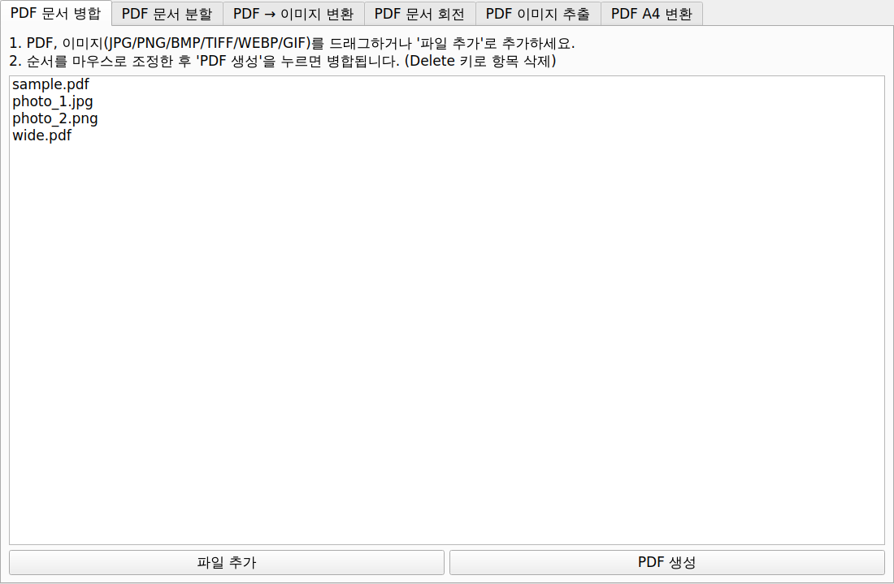
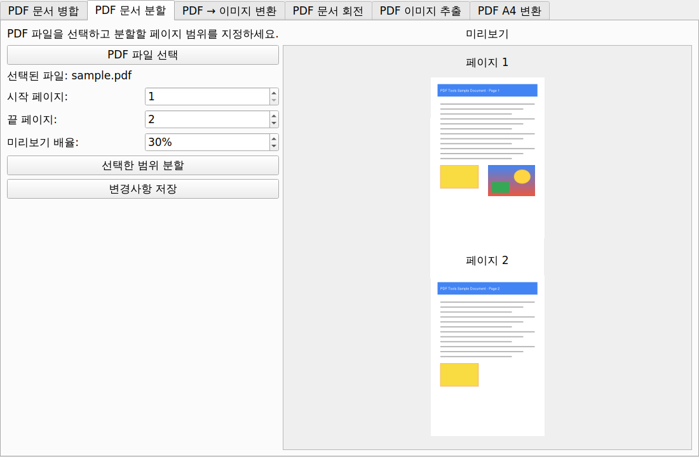
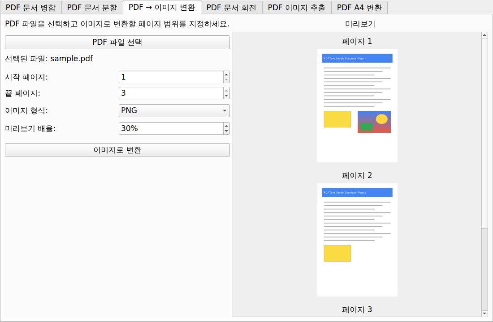
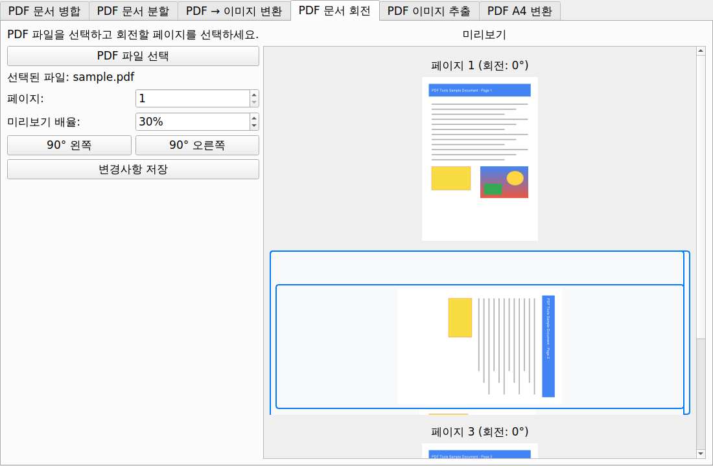
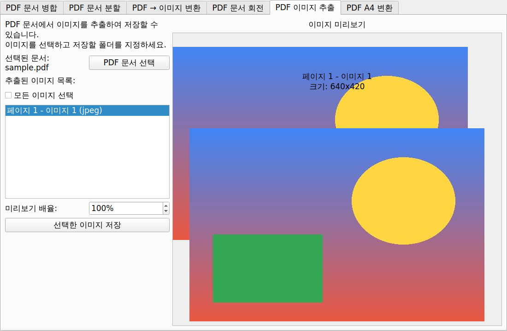
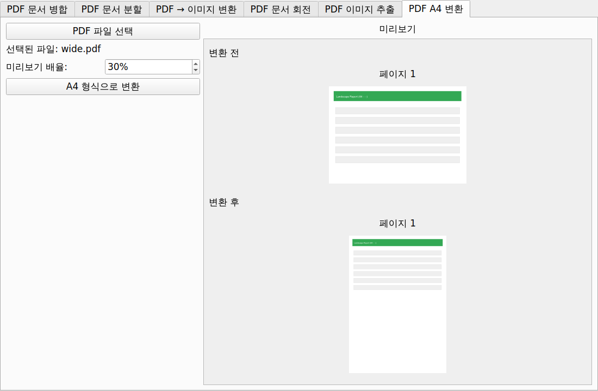

<div align="center">

# 📄 PDF Composer

**PDF 편집을 위한 올인원 데스크톱 도구 — 병합 · 분할 · 회전 · 변환 · 추출**

[](https://github.com/Seobuk/PDF_tools/releases/latest)
[](https://www.python.org/)
[](https://pypi.org/project/PyQt5/)
[](https://opensource.org/licenses/MIT)

설치 없이 쓰고 싶다면 → **[최신 버전 PDF_Tools.exe 다운로드](https://github.com/Seobuk/PDF_tools/releases/latest)**

[English](README.md) · 🌐 **한국어**

</div>

---

## ✨ 기능 한눈에 보기

| 탭 | 기능 | 특징 |
|---|---|---|
| 📑 **PDF 문서 병합** | 여러 PDF와 이미지를 하나의 PDF로 | 드래그 앤 드롭, 순서 조정, JPG/PNG/BMP/TIFF/WEBP/GIF 지원, EXIF 회전 자동 보정 |
| ✂️ **PDF 문서 분할** | 페이지 범위를 새 PDF로 저장 | 실시간 미리보기로 범위 확인 |
| 🖼️ **PDF → 이미지 변환** | 페이지를 PNG/JPEG로 저장 | 300 DPI 고해상도 출력 |
| 🔄 **PDF 문서 회전** | 페이지를 90° 단위로 회전 | 미리보기에서 클릭으로 다중 선택, 선택한 페이지만 즉시 갱신 |
| 🧲 **PDF 이미지 추출** | 문서에 내장된 이미지를 원본 그대로 추출 | 전체 선택, 원본 형식(jpeg/png 등) 유지 |
| 📐 **PDF A4 변환** | 제각각인 페이지 크기를 A4로 통일 | 변환 전/후 나란히 미리보기 |

모든 탭의 미리보기는 **Ctrl + 마우스 휠**로 확대/축소할 수 있습니다.

---

## 🚀 시작하기

### 방법 1 — 실행 파일 (Windows)

[릴리즈 페이지](https://github.com/Seobuk/PDF_tools/releases/latest)에서 `PDF_Tools.exe`를 내려받아 바로 실행하세요. 별도 설치가 필요 없습니다.

### 방법 2 — 소스에서 실행

```bash
git clone https://github.com/Seobuk/PDF_tools.git
cd PDF_tools
pip install -r requirements.txt
python main.py
```

### 직접 exe 빌드하기 (선택)

```bash
pyinstaller --noconsole --onefile --name PDF_Tools main.py
```

---

## 📸 기능 소개

### 📑 PDF 병합

PDF와 이미지(JPG/PNG/BMP/TIFF/WEBP/GIF)를 드래그하거나 '파일 추가' 버튼으로 추가한 뒤,
마우스로 순서를 조정하고 'PDF 생성'을 누르면 하나의 PDF로 병합됩니다.
휴대폰 사진의 EXIF 회전 정보도 자동으로 보정됩니다. (Delete 키로 항목 삭제)



### ✂️ PDF 분할

PDF 파일을 선택하고 분할할 페이지 범위를 지정하면 미리보기로 확인하면서 분할할 수 있습니다.



### 🖼️ PDF → 이미지 변환

변환할 페이지 범위와 이미지 형식(PNG/JPEG)을 지정해 페이지를 300 DPI 고해상도 이미지로 저장합니다.



### 🔄 PDF 회전

미리보기에서 페이지를 클릭해 선택(파란 테두리)하고 90도 왼쪽/오른쪽 버튼으로 회전한 뒤 저장합니다.
여러 페이지를 선택해 한 번에 회전할 수 있습니다.



### 🧲 이미지 추출

PDF에 포함된 이미지를 목록으로 추출하고, 선택한 이미지를 원본 형식 그대로 저장합니다.



### 📐 PDF A4 포매팅

가로 문서 등 규격이 제각각인 PDF를 A4 크기에 맞게 변환하고, 변환 전/후를 나란히 미리볼 수 있습니다.



---

## 🗂️ 프로젝트 구조

```
PDF_tools/
├── main.py                       # 앱 진입점 (Fusion 스타일 적용)
├── requirements.txt
├── docs/screenshots/             # README 스크린샷
└── src/
    ├── ui/
    │   ├── main_window.py            # 탭 기반 메인 윈도우
    │   ├── pdf_combiner.py           # 📑 PDF/이미지 병합
    │   ├── pdf_splitter.py           # ✂️ 페이지 범위 분할
    │   ├── pdf_to_image.py           # 🖼️ PDF → PNG/JPEG 변환
    │   ├── pdf_rotator.py            # 🔄 페이지 회전
    │   ├── pdf_image_extractor.py    # 🧲 내장 이미지 추출
    │   ├── pdf_formatter_tab.py      # 📐 A4 변환
    │   ├── preview.py                # 미리보기 공통 헬퍼 (렌더링/배율/패널)
    │   ├── zoomable_scroll_area.py   # Ctrl+휠 확대/축소 스크롤 영역
    │   └── styles.py                 # 공통 스타일 상수
    └── utils/
        └── pdf_handler.py            # 병합·이미지→PDF 변환 로직
```

## 🛠️ 기술 스택

| 역할 | 라이브러리 |
|---|---|
| GUI | [PyQt5](https://pypi.org/project/PyQt5/) (Fusion 스타일) |
| PDF 렌더링·회전·분할 | [PyMuPDF (fitz)](https://pymupdf.readthedocs.io/) |
| PDF 병합·A4 변환 | [PyPDF2](https://pypdf2.readthedocs.io/) |
| 이미지 처리 | [Pillow](https://pillow.readthedocs.io/) |
| 실행 파일 빌드 | [PyInstaller](https://pyinstaller.org/) |

릴리즈는 GitHub Actions로 자동화되어 있습니다 — `main` 브랜치에서 `.release-trigger`가 변경되면
태그 생성, 릴리즈 노트 발행([RELEASE_NOTES.md](RELEASE_NOTES.md) 기반), Windows exe 빌드/업로드가 자동으로 진행됩니다.

## 📄 라이선스

이 프로젝트는 [MIT 라이선스](https://opensource.org/licenses/MIT) 하에 배포됩니다.

<div align="center">

만든사람 **SHU** · 버그 제보와 기능 제안은 [Issues](https://github.com/Seobuk/PDF_tools/issues)로 남겨주세요 🙌

</div>
